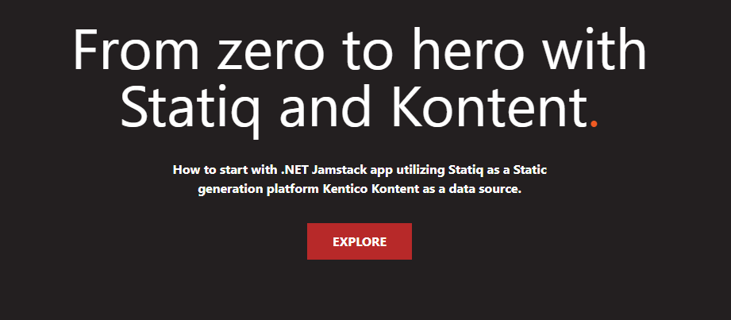

# Statiq boilerplate for Kontent

Boilerplate utilizing [Statiq](https://statiq.dev/) and [Kentico Kontent](https://kontent.ai) to provide a starting point in the Jamstack world for .NET developers.



## Get started

### Requirements

- [.NET 5](https://dotnet.microsoft.com/download)

### Clone the codebase

1. Click the ["Use this template"](https://github.com/petrsvihlik/statiq-starter-kontent-lumen/generate) button to [create your own repository from this template](https://help.github.com/en/github/creating-cloning-and-archiving-repositories/creating-a-repository-from-a-template).

### Running locally

```sh
dotnet run -- preview
```

🎊🎉 **Visit <http://localhost:5080> and start exploring the code base!**

> By default, the content is loaded from a shared Kentico Kontent project. If you want to use your own clone of the project so that you can customize it and experiment with Kontent, continue to the next section.

### Create a content source

1. Go to [app.kontent.ai](https://app.kontent.ai) and [create an empty project](https://docs.kontent.ai/tutorials/set-up-kontent/projects/manage-projects#a-creating-projects)
1. Go to the "Project Settings", select API keys and copy the following keys for further reference
    - Project ID
    - Management API key
1. Use the [Template Manager UI](https://kentico.github.io/kontent-template-manager/import) for importing the content from [`kontent-backup.zip`](./kontent-backup.zip) file and API keys from previous step. Check *Publish language variants after import* option before import.

    > Alternatively, you can use the [Kontent Backup Manager](https://github.com/Kentico/kontent-backup-manager-js) and import data to the newly created project from [`content.zip`](./content.zip) file via command line:
    >
    >   ```sh
    >    npm i -g @kentico/kontent-backup-manager
    >
    >    kbm --action=restore --projectId=<Project ID> --apiKey=<Management API key> --zipFilename=content
    >    ```
    >
    > Go to your Kontent project and [publish all the imported items](https://docs.kontent.ai/tutorials/write-and-collaborate/publish-your-work/publish-content-items).

1. Map the codebase to the data source
    - adjust the `WithProjectId` call in [Program.cs](./Program.cs) with your project ID.

🚀 **You are now ready to use the site with your own Kentico Kontent project as data source on <http://localhost:5080>!** 🚀

## Features

- [Kontent Model Generator](https://github.com/Kentico/kontent-generators-net) for generating strongly-typed models from Kontent model.
- [Kontent.Statiq](https://www.nuget.org/packages/Kontent.Statiq) module for simple data loading from Kontent to strongly-typed models
- [Sass](https://sass-lang.com/) initial styles for easier style including [reset.css](http://meyerweb.com/eric/tools/css/reset/)
- Razor template engine setup with simple layout

## How it's build

All of the information about boilerplate creation and the content modeling in Kentico Kontent have been written up on the blog post [Jamstack on .NET - From zero to hero with Statiq and Kontent](https://ondrej.chrastina.tech/journal/jamstack-on-net-from-zero-to-hero-with-statiq-and-kontent).

## Resources

See more complex sample application: [Kentico Kontent Statiq - Lument Starter](https://github.com/Kentico/statiq-starter-kontent-lumen 
